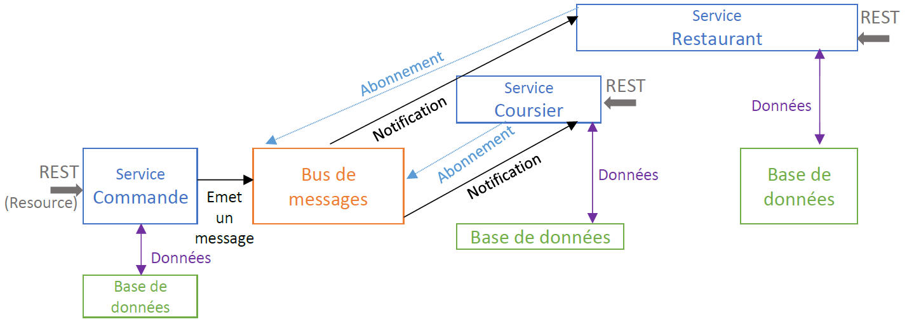

# SOA Project: Uberoo

Uberoo is a brand new food delivery service, which plans to start a new business in Sophia Antipolis mid-November. It allows restaurant owners to publish food items (single courses or full menus) on a web platform, and customers to order such items. The  items are then delivered by coursiers directly to the customers’ workplace. The originality of Uberoo, opposed to the existing platforms, is that instead of requiring a fixed delivery schedule, the system computes on the fly an Estimated Time of Arrival (ETA) for each delivery. Thus, an important Key Performance Indicator (KPI) for the platform is the TBETOF: “Time Before Eating The Ordered Food”.

## Getting Started

### Prerequisites

- Docker

### Installing

```bash
./install.sh # Build images for each service
docker-compose up
./run.sh # Runs all scenarii
./load.sh # Runs load testing using Gatling
```

## Architecture

[](final.pdf)

## User Stories

- **MVP:** As Bob, a hungry student, I browse the food catalogue offered by Uberoo; I decide to go for an Asian meal, ordering a ramen soup; The system estimates the ETA (e.g., 45 mins) for the food, and I decide to accept it; The restaurant can consult the list of meals to prepare, and start the cooking process; A coursier is assigned to my order, and deliver it on the campus.
- **Scenario#1:** As Gail or Erin, I can order my lunch from a restaurant so that the food is delivered to my place.
- **Scenario#2:** As Gail, I can browse the food catalogue by categories so that I can immediately identify my favorite junk food.
- **Scenario#3:** As Erin, I want to know before ordering the estimated time of delivery of the meal so that I can schedule my work around it, and be ready when it arrives.
- **Scenario#4:** As Erin, I can pay directly by credit card on the platform, so that I only have to retrieve my food when delivered.
- **Scenario#5:** As Jordan, I want to access to the order list, so that I can prepare the meal efficiently.
- **Scenario#6:** As Jamie, I want to know the orders that will have to be delivered around me, so that I can choose one and go to the restaurant to begin the course.
- **Scenario#7:** As Jamie, I want to notify that the order has been delivered, so that my account can be credited and the restaurant can be informed.
- **Scenario#8:** As Jordan, I want the customers to be able to review the meals so that I can improve them according to their feedback.
- **Scenario#9:** As a customer (Gail, Erin), I want to track the geolocation of the coursier in real time, so that I can anticipate when I will eat.
- **Scenario#10 (partially implemented):** As Terry, I want to get some statistics (speed, cost) about global delivery time and delivery per coursier.
- **Scenario#11 (not implemented):** As Terry, I can emit a promotional code so that I can attract more customer to my restaurant.
- **Scenario#12 (partially implemented):** As Jamie, I want to inform quickly that I can't terminate the course (accident, sick), so that the order can be replaced.
- **Scenario#13 (not implemented):** As Terry, I can emit a promotional code based on my menu contents (e.g., 10% discount for an entry-main course-dessert order), so that I can sell more expensive orders.
- **Scenario#14 (not implemented):** As Gail or Erin, I can follow the position of Jamie in real time, so that the food ETA can be updated automatically.